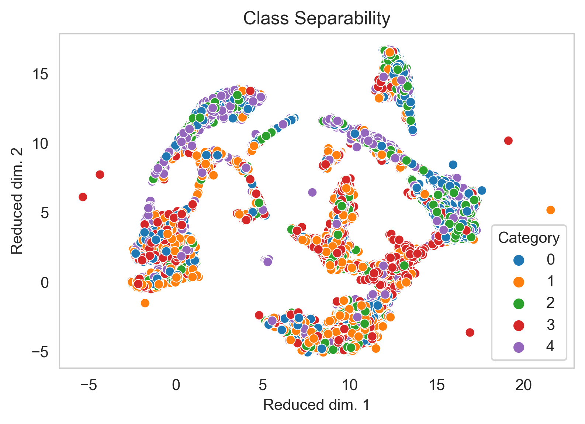
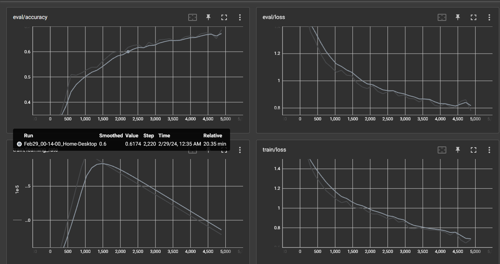

# Comparing Arabic Sentence Embedding Transformers
There is a scarcity of evidence and benchmarks indicating the performance of sentence embedding transformers on Arabic language text, **_especially_** for smaller models that can be trained on a single "garden-variety" GPU (such as those used for gaming). Here I test a few different sentence embedding models on a multi-class classification problem to see which performs better. 

##  Dataset
The dataset used consists of 25,000 labeled examples, with arabic poems (representing the text to be embedded), and labels (indicating the historical era the poem comes from). This dataset was obtained from [Kaggle](https://www.kaggle.com/competitions/arabic-poem-classification/overview). It was split into a 80%-20% for tain-eval.  
The 5 historical eras (classes) are mapped to numerical values (0,1,2,3,4) before training. 
As some of the poems exceeded the context length of the transformers used, 512 tokens ~350 words, the longer poems were _chunked_ into smaller strings, each with the same label as the original poem.  

A class separability graph prouced by [UMAP](https://umap-learn.readthedocs.io/en/latest/) for all the training text embeddings, after passing it through the trasnformer once (this already indicates that finetuning will likely produce much better results, as they are do not look very separable, at least by eye).
  

## Training Procedures
All training was performed locally on a single NVIDIA RTX 3060Ti.  

1) The first training procedure used a transformer model to produce the embeddings or _hidden states_, this involves passing the dataset through the transformer once, then using the produced hidden states as features to train a NN classifier (the transformer weights are frozen and not updated). These hidden states encode the meaning of the sentence accounting for context. The NN classifier is fully connected with 2 hidden layers, a 768 dim input layer (the dim of the embeddings output by the transformer), and a 5 dim output layer (the log odds of each label, which are later turned into probabilities via softmax).

2) The second training procedure (facilitated by the Hugging Face Trainer), trained both transformer and classifier (the gradients flow all the way back), to optimize the produced embeddings specifically for this classification task.

Below is the best training run (top performing model in the table below), using a linear learning rate scheduler, and a warmup peroid and then a decay as seen in the bottom left graph (indidentally I also tested without a scheduler and the differences were minor, ~1%). The training run parameters were tracked in TensorBoard.

## Model Comparison
Here is the model performance in order.

| Model | Eval Accuracy (%) |
|----------|----------|
| [distilbert-base-multilingual-cased](https://huggingface.co/distilbert/distilbert-base-multilingual-cased) | ~68% |
| [multilingual-e5-small](https://huggingface.co/intfloat/multilingual-e5-small) | ~60% |
| [Arabic-KW-Mdel](https://huggingface.co/medmediani/Arabic-KW-Mdel) | ~57% |
| Feature Extraction (frozen model) | ~50% |

Note that 50% acc is not random performance (as this is not binary classfication).  
One mildly surprising thing, was that chunking vs no chunking produced a barely visibile imprvovement (<~1%) despite adding an extra ~1000 training examples (and as mentioned earlier, learning rate scheduling also produced a barely visible effect).  
What was more surprising was the worse perfomance of _multilingual-e5-small_ model, as it has a relatively high score (at the time of writing) on the [MTEB HF Leaderboard](https://huggingface.co/spaces/mteb/leaderboard). It is true this is score is weighted heavier for English text, but still multilingual-e5-small has a relatively high score on text classification outperforming signtificantly larger models (models multiple times its size), so this came as a surprise somewhat. 

# Conclusion
In conlcusion, the best sentence embedding transformer for Arabic text classification (given limited compute resources), is still finetuned old faithful, _distilbert-base-multilingual-cased_!
